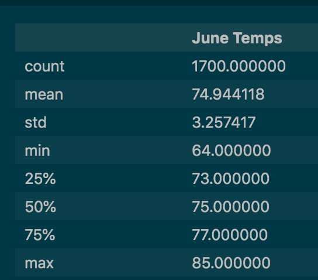
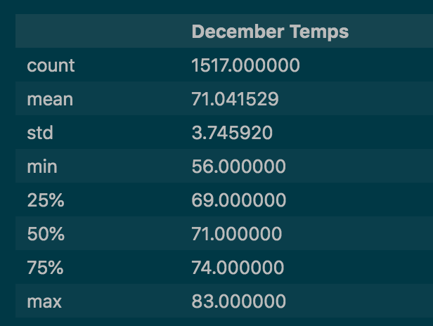
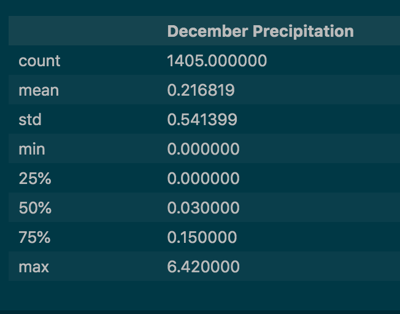

# Surfs Up Project

## Overview
### Purpose
The purpose of this project is to conduct analysis on the weather conditions in Oahu for the months of June and December to help deciding on whether it's a good idea to open a surf shop. Based on the required weather conditions for surfing, temperature and precipitation data are collected and analyzed.
### Tools
To better assist the analysis, SQLite database, Python SQLAlchemy package, and python Flask - web framework are used in this project.

## Results
Through the data from the sqlite database, June and December temperature data were filtered out, see below as the major points concluded from the analysis:

* June temperature average is 74.94 degrees Fahrenheit from 1700 valid temperature data records. See below for the summary of June data analysis:



* December temperature average is 71.04 degrees Fahrenheit from 1517 valid temperture data records. See below for the summary of June data analysis:



* Between June and December, there is no significant difference between the temperature that could affect the surf shop business.

## Summary
In general, regarding the temperature aspect of the weather, it's only less than 5 degrees colder on average in December compared to the temperature in June at Oahu. And the precipitation level is quite fit for surfing. Here are two additional queries that can be used to get analysis on the precipitation in the area: 

```
june_prcp = session.query(Measurement.prcp).\
    filter(func.strftime("%m", Measurement.date)=="06").all()


dec_prcp = session.query(Measurement.prcp).\
    filter(func.strftime("%m", Measurement.date)=="12").all()
```
From the above queries, there are more than 1400 records for each month (June and December) for precipation data. The rain is enough to keep the plants green, and not so much that will force the surf and ice cream shop out of business. Here is a summary of December precipitation analysis, which is just slightly above the numbers in the June precipitation analysis.

